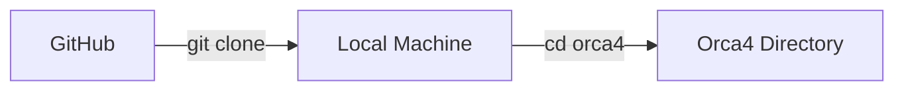
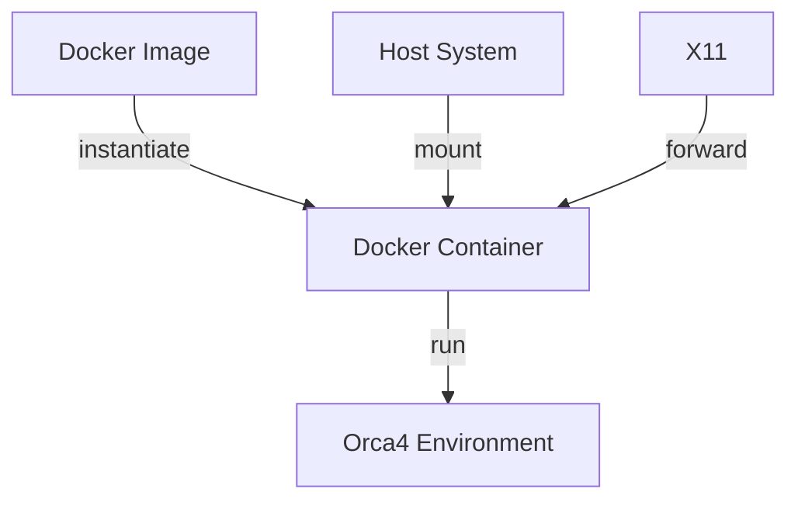
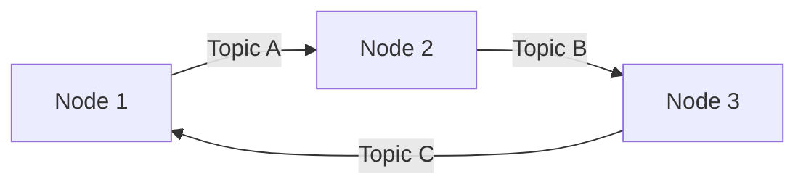
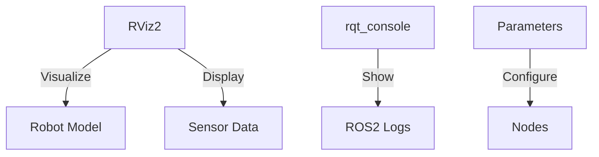

# Orca4 Hackathon: Getting Started

---

## 1. Cloning the Repository

Clone the Orca4 repository:

```bash
git clone https://github.com/WHOIGit/orca4.git
cd orca4
```



---

## 2. Docker Basics

- **Image**: Executable package with all dependencies
- **Container**: Runtime instance of an image

Run Orca4 container:
```bash
./docker_run.sh
# For NVIDIA GPUs:
./docker_run_nvidia.sh
```



---

## 3. ROS2 Basic Commands

- List nodes: `ros2 node list`
- List topics: `ros2 topic list`
- Echo topic: `ros2 topic echo /topic_name`
- Node info: `ros2 node info /node_name`

Launch Orca4:
```bash
ros2 launch orca_bringup sim_launch.py
```



---

## 4. Git Versioning Basics

- Pull changes: `git pull origin main`
- Commit changes:
  ```bash
  git add .
  git commit -m "Your message"
  ```
- Create branch: `git checkout -b new-branch`
- Push changes: `git push origin branch-name`


---

## 5. Additional Tips

- Visualize: `rviz2`
- Monitor logs: `ros2 run rqt_console rqt_console`
- List parameters: `ros2 param list`
- Set parameter: `ros2 param set /node param value`

Refer to project documentation for Orca4-specific details.


